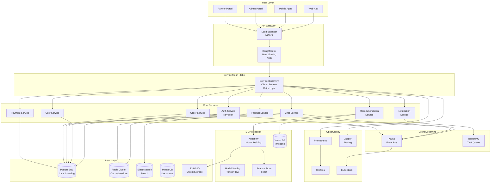

# ShopMindAI System Architecture

## 🏢 Enterprise Architecture Overview



## 🔧 Technology Stack Details

### Frontend Architecture
```
apps/
├── web/                    # Next.js 14 (App Router)
│   ├── app/               # Pages & Layouts
│   ├── components/        # Feature components
│   └── lib/              # Utils & API clients
├── mobile/               # React Native + Expo
│   ├── src/             # Source code
│   └── native/          # Platform-specific
├── admin/               # Internal dashboard (Next.js)
└── partner-portal/      # B2B portal (Next.js)
```

### Backend Architecture
```
services/
├── auth-service/         # Go + Keycloak integration
├── user-service/         # Go + PostgreSQL
├── chat-service/         # Go + WebSocket + Redis
├── product-service/      # Go + Elasticsearch
├── recommendation-service/# Python + ML models
├── order-service/        # Go + PostgreSQL
├── payment-service/      # Go + Stripe/PayPal
├── notification-service/ # Go + RabbitMQ
└── analytics-service/    # Go + ClickHouse
```

### Shared Packages
```
packages/
├── ui/                   # Design System (Storybook)
├── api-client/          # Type-safe API client
├── config/              # Shared configurations
├── utils/               # Common utilities
├── analytics/           # Analytics wrapper
├── feature-flags/       # LaunchDarkly integration
└── localization/        # i18n support
```

## 🚀 Scalability Strategy

### 1. **Horizontal Scaling**
- Auto-scaling based on CPU/Memory/Custom metrics
- Pod Disruption Budgets for high availability
- Multi-region deployment with geo-routing

### 2. **Database Sharding**
- Citus for PostgreSQL horizontal sharding
- Partition by tenant_id for multi-tenancy
- Read replicas for query distribution

### 3. **Caching Layers**
- Redis for session management
- CDN for static assets (Cloudflare)
- Application-level caching with React Query
- Database query caching

### 4. **Event-Driven Architecture**
- Kafka for event streaming
- Asynchronous processing
- Event sourcing for audit trails
- CQRS pattern where applicable

## 🔐 Security Architecture

### Authentication & Authorization
```
┌─────────────────┐     ┌─────────────────┐     ┌─────────────────┐
│   Web/Mobile    │────►│   API Gateway   │────►│    Keycloak     │
│      Apps       │     │  (Token Valid)  │     │   (SSO/OIDC)    │
└─────────────────┘     └─────────────────┘     └─────────────────┘
                                │                         │
                                ▼                         ▼
                        ┌─────────────────┐     ┌─────────────────┐
                        │   OPA Policies  │     │   User Store    │
                        │   (Fine-grain)  │     │  (PostgreSQL)   │
                        └─────────────────┘     └─────────────────┘
```

### Security Layers
1. **Network Security**
   - VPC with private subnets
   - Network policies in K8s
   - mTLS between services

2. **Application Security**
   - OWASP compliance
   - Input validation
   - SQL injection prevention
   - XSS protection

3. **Data Security**
   - Encryption at rest (AES-256)
   - Encryption in transit (TLS 1.3)
   - Key rotation with Vault
   - PII data masking

## 📊 Data Flow Architecture

### Real-time Chat Flow
```
User → WebSocket → Chat Service → Redis Pub/Sub → Other Users
                        ↓
                     Kafka → PostgreSQL (Persistence)
                        ↓
                  Analytics Service
```

### Product Search Flow
```
User → API Gateway → Product Service → Elasticsearch
                           ↓
                    Recommendation Service → ML Model
                           ↓
                      Response Cache → User
```

## 🎯 Performance Targets

| Metric | Target | Current |
|--------|--------|---------|
| API Latency (p50) | < 50ms | - |
| API Latency (p99) | < 200ms | - |
| Availability | 99.99% | - |
| Error Rate | < 0.1% | - |
| Concurrent Users | 10M+ | - |
| Messages/Second | 1M+ | - |

## 🔄 Deployment Pipeline

```
Developer → Git Push → GitHub Actions → Build & Test → Security Scan
                                              ↓
                                        Docker Build → Registry
                                              ↓
                                         ArgoCD Sync
                                              ↓
                                   ┌──────────┴──────────┐
                                   ▼                     ▼
                            Staging Env           Canary Deploy (5%)
                                   ↓                     ↓
                            E2E Tests            Monitor Metrics
                                   ↓                     ↓
                                   └────────┬────────────┘
                                            ▼
                                    Production (100%)
```

## 🏗️ Infrastructure as Code

### Terraform Modules
```
infrastructure/terraform/
├── modules/
│   ├── vpc/           # Network infrastructure
│   ├── eks/           # Kubernetes cluster
│   ├── rds/           # PostgreSQL setup
│   ├── elasticache/   # Redis cluster
│   └── s3/            # Object storage
└── environments/
    ├── dev/
    ├── staging/
    └── production/
```

### Kubernetes Resources
```
infrastructure/kubernetes/
├── base/              # Base configurations
├── overlays/          # Environment-specific
│   ├── dev/
│   ├── staging/
│   └── production/
└── charts/            # Helm charts
```

## 📈 Monitoring & Observability

### Metrics Collection
- **Infrastructure**: Node metrics, K8s metrics
- **Application**: Custom business metrics
- **Database**: Query performance, connections
- **Cache**: Hit rates, evictions

### Dashboards
1. **Executive Dashboard**: KPIs, revenue, users
2. **Operations Dashboard**: System health, alerts
3. **Developer Dashboard**: API metrics, errors
4. **Security Dashboard**: Threats, compliance

## 🚨 Disaster Recovery

### Backup Strategy
- **Database**: Daily snapshots, point-in-time recovery
- **Object Storage**: Cross-region replication
- **Configuration**: GitOps with version control

### RTO/RPO Targets
- **RTO (Recovery Time Objective)**: < 1 hour
- **RPO (Recovery Point Objective)**: < 5 minutes

### Failover Process
1. Automated health checks detect failure
2. Traffic redirected to healthy region
3. Database failover to standby
4. Cache warmed from backup
5. Notification to ops team

## 🔮 Future Enhancements

### Phase 1 (Q1 2024)
- [ ] Implement GraphQL Federation
- [ ] Add real-time collaborative features
- [ ] Enhance ML recommendations

### Phase 2 (Q2 2024)
- [ ] Multi-language support
- [ ] Blockchain integration for payments
- [ ] Advanced analytics dashboard

### Phase 3 (Q3 2024)
- [ ] Voice interface
- [ ] AR shopping experience
- [ ] Predictive scaling